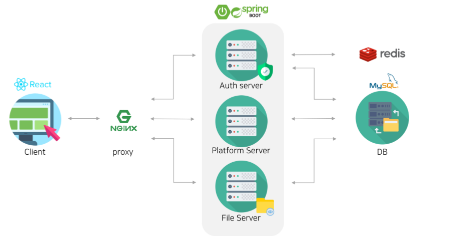
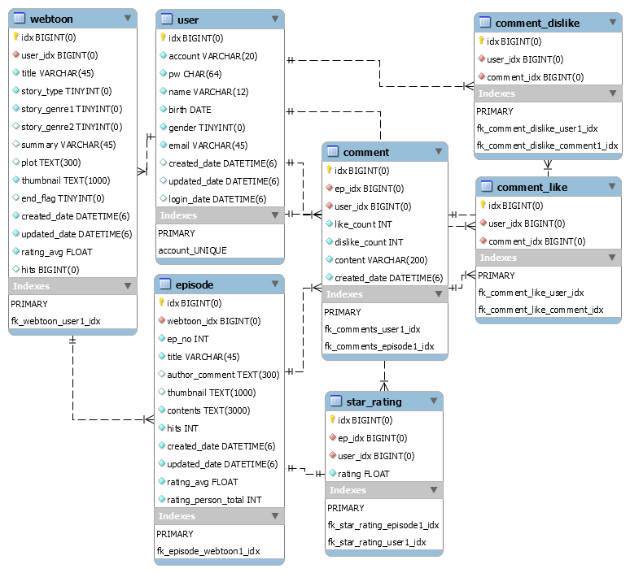

# 웹툰 서비스

## 저장소 설명


기존에 했던 [프로젝트](https://github.com/Smilegate-WWW/wow-welcome-webtoon) 에서 공부하면서 개선 하고 싶었던 것을 작업 중인 저장소 입니다.

<br/>

> 유저가 자신의 웹툰을 등록하거나 다른 사람의 웹툰을 볼 수 있는 서비스입니다.
>
> 웹툰을 보고 별점을 매길 수 있습니다.
>
> 댓글을 달 수 있고 댓글에 좋아요 혹은 싫어요를 요청할 수 있습니다.

## 프로젝트 기술스택

- Java 8

- Spring Boot 2.2.x

  - Spring Data JPA

  - Spring Security

- MySQL

- Redis

- Nginx

- Junit5, AssertJ

- React
---

## Architecture



---

## Database



---

## API 문서

>- [인증서버 API](https://documenter.getpostman.com/view/10215521/SWTK3Dqq) </br>
>- [파일서버 API](https://documenter.getpostman.com/view/10254430/SzKSRygn) </br>
>- [플랫폼 서버 API](https://documenter.getpostman.com/view/9773992/SzKWtGnX) </br>

---

## File Structure

```
├── backend
│   └── webtoon-core
│   └── webtoon-auth
│   └── webtoon-file
│   └── webtoon-platform
└── frontend
```

[맨 위로 가기](#top)
</br>

---

## 작업 정리표

### 개선 내용

| 분류 | 기존 방식 | 개선 내용 | 참고 |
| :-: | :-: | :-: | :-: |
| Test | Test Code 작성 X  | Junit5 + AssertJ, Mockito를 이용해 Unit Test 작성 | [#6](https://github.com/momojh94/wow-welcome-webtoon/pull/6) [#10](https://github.com/momojh94/wow-welcome-webtoon/pull/10) |
| Test | Postman을 이용해 수동으로 API 문서화 | API 문서 자동화 도구인 Spring Rest Docs 도입 및 문서화 자동 전환 |  [#16](https://github.com/momojh94/wow-welcome-webtoon/pull/16) |

</br>

### 추가 내용

| 분류 | 내용 | 참고 |
| :-: | :-: | :-: |
| Test | JaCoCo 적용 - Code Coverage 확인 용도 | [#8](https://github.com/momojh94/wow-welcome-webtoon/pull/8) |


